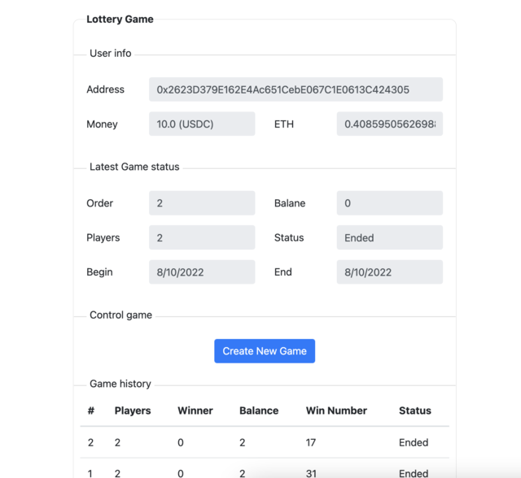
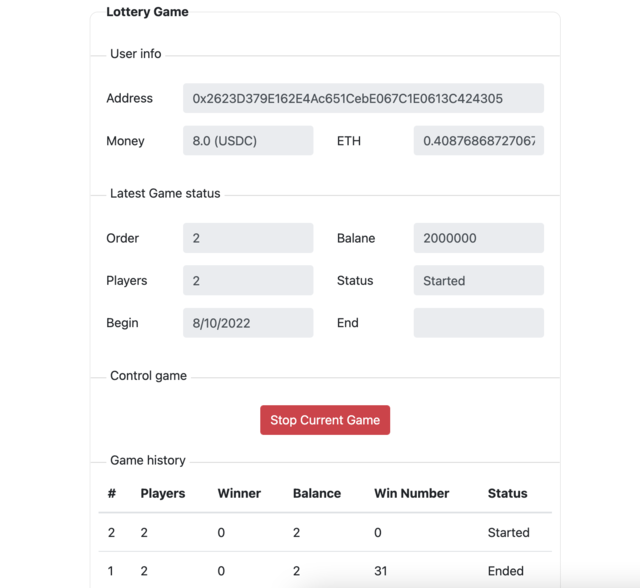
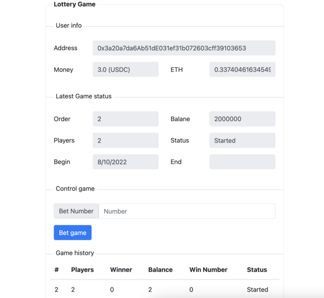

# The lottery game

## Try running some of the following tasks:
```
npm install
```
### - `Run Unit test`
```shell
npx hardhat test
```
### - `Build localhost`
```shell
npx hardhat compile
npx hardhat node
npx hardhat run --network localhost scripts/deploy.js
```
Then, in another shell, run a script to testing game:
```shell
npx hardhat set-currency --network localhost
npx hardhat create-game --network localhost
npx hardhat bet --account 1 --number 10 --network localhost
npx hardhat stop-game --network localhost
```
`set-currency`, `create-game`, `bet`, `stop-game` are task of hardhat. Please get more detail at `tasks` folder.
### - `Build Goerli testnet network`
Accounts list: 
```
Owner: 
- key: 42cc6a7e9e9b6b5e3fca6d75ae4767a76cb9c216f1c30ee639e6037418d6f0cc
- address: 0x2623D379E162E4Ac651CebE067C1E0613C424305
Player1: 
- key: e314631d3a8d9f1610aae67dd52c37a6912c5ddf2b8b9236660c5b2d6d248b0a
- address: 0xAD6B6248D02d35ee58dF289A8C591f857F418fce
Player2: 
- key: 6ef389a470d7ad919d920e8d4f7930d7f72e2b4f9c7550826cb062cd425f3925
- address: 0x3a20a7da6Ab51dE031ef31b072603cff39103653
```
Deploy to testnet
```shell
npx hardhat compile
npx hardhat run --network goerli scripts/deploy-testnet.js
````
### `Metamask Setup`
- Network: Goerli testnet
- USDC and GoerliETH to player game
- USDC faucet: https://usdcfaucet.com/
- GoerliETH faucet: https://goerlifaucet.com/
### `UI Setup` 
- folder client
```
REACT_APP_MONEY_ADDRESS=0x07865c6e87b9f70255377e024ace6630c1eaa37f // Currency of game (USDC)
REACT_APP_LOTTERY_ADDRESS=0x0a9B5F93EEcfEaef7f3E1BbD57B38E9613c20725 // Game address
REACT_APP_NETWORK_ID=5 // chainid of network
REACT_APP_DEALER=0x2623D379E162E4Ac651CebE067C1E0613C424305 // owner of game
REACT_APP_SCAN_URL=https://goerli.etherscan.io/
```
### - `UI: Goerli testnet`
```shell
cd client
cp .env.example .env
npm install
npm start
```

#### Dealer 
- Change network of metamask to Goerli Test Network.
- Change account in metamask to `Owner` to create new game.
---

---
- After create a new game. The stop button will be show. Click this button to stop game.
---


#### Player
 - Change network of metamask to Goerli Test Network.
 - With account does not Delear will show below screen
---
